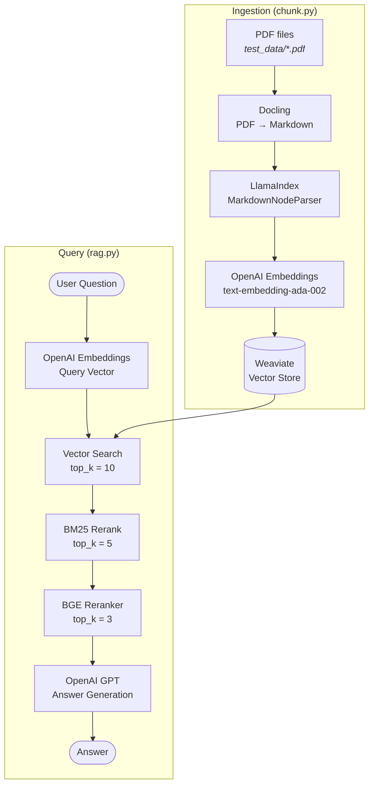
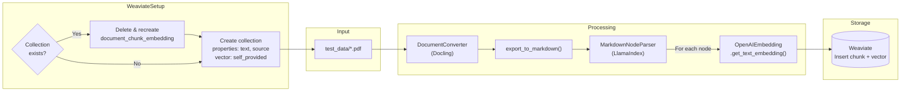
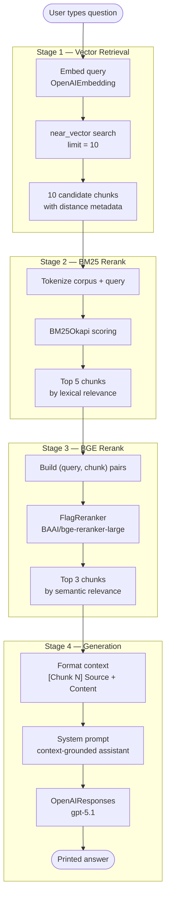
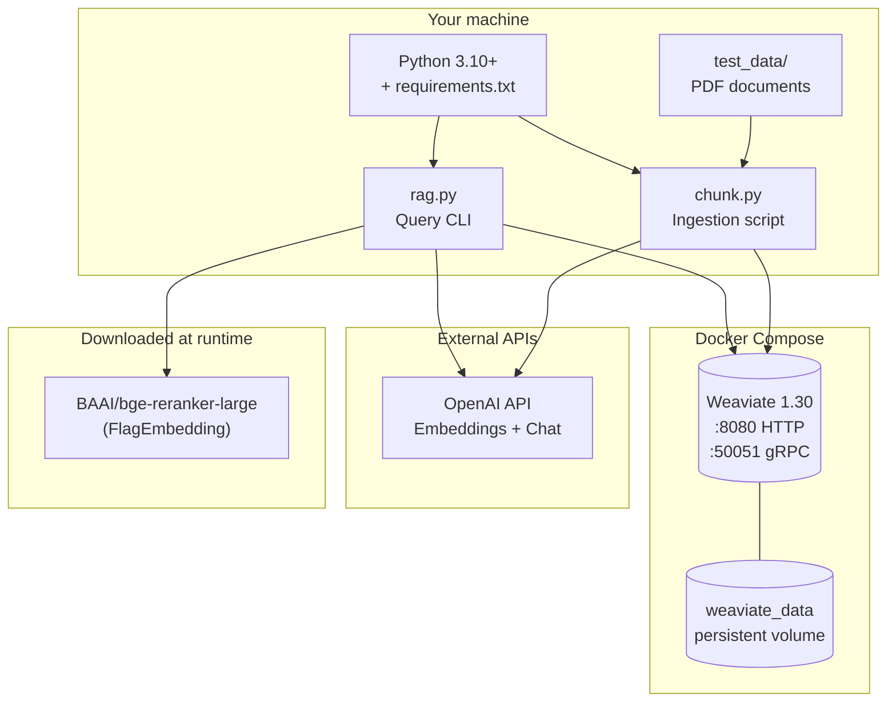

# Learning RAG Workflow

A hands-on Retrieval-Augmented Generation (RAG) pipeline that ingests PDF documents, stores vector embeddings in Weaviate, and answers questions using a multi-stage retrieval and reranking strategy.

**Stack:** Weaviate · OpenAI (embeddings + LLM) · Docling · LlamaIndex · BM25 · BGE Reranker

---

## Architecture Overview



---

## Ingestion Pipeline (chunk.py)

Run once (or whenever documents change) to parse PDFs, chunk them, embed each chunk, and load vectors into Weaviate.



**What happens step by step:**

1. **Connect to Weaviate** — local instance at `localhost:8080`.
2. **Reset collection** — drops `document_chunk_embedding` if it already exists, then recreates it with `text`, `source`, and client-supplied vectors (`DEFAULT_VECTORIZER_MODULE: none` in Docker).
3. **For each PDF in `test_data/`:**
   - Docling converts the PDF to Markdown.
   - LlamaIndex splits Markdown into nodes (chunks).
   - OpenAI embeds each chunk.
   - Chunk text, source filename, and vector are inserted into Weaviate.

---

## Query Pipeline (rag.py)

Interactive CLI loop: embed the question, retrieve candidates, rerank in two stages, then generate an answer with context.



**Why three retrieval stages?**

| Stage | Method | Role |
|-------|--------|------|
| Vector search | Cosine similarity on embeddings | Broad semantic recall — finds conceptually related chunks |
| BM25 | Lexical keyword matching | Filters noise; boosts chunks that share terms with the query |
| BGE reranker | Cross-encoder scoring | Fine-grained (query, passage) relevance before sending context to the LLM |

Only the final **3 chunks** are passed to the model, keeping the prompt focused and within context limits.

---

## System Components



---

## Prerequisites

- **Python 3.10+**
- **Docker** (for Weaviate)
- **OpenAI API key** (embeddings + chat completions)

Place PDF files in a `test_data/` directory at the project root before running ingestion.

---

## Setup & Usage

### 1. Create a virtual environment and install dependencies

**macOS / Linux**
```bash
python3 -m venv .venv
source .venv/bin/activate
pip3 install -r requirements.txt
```

**Windows**
```bash
python -m venv .venv
.venv\Scripts\activate
pip install -r requirements.txt
```

### 2. Configure environment variables

Copy the example file and add your API key:

```bash
cp .env.example .env
```

Edit `.env`:
```bash
OPENAI_API_KEY=your_api_key_here
```

### 3. Start Weaviate and ingest documents

```bash
docker compose up -d
python3 chunk.py    # macOS / Linux
python chunk.py     # Windows
```

### 4. Run the RAG CLI

```bash
python3 rag.py      # macOS / Linux
python rag.py       # Windows
```

Type a question at the prompt. Enter `exit` to quit.

---

## Project Structure

```
learning-rag-workflow/
├── chunk.py              # PDF ingestion → Weaviate
├── rag.py                # Interactive Q&A with reranking
├── docker-compose.yml    # Weaviate service
├── requirements.txt      # Python dependencies
├── .env.example          # Environment variable template
└── test_data/            # Place PDF files here (create if missing)
```

---

## Configuration Reference

| Setting | Location | Default |
|---------|----------|---------|
| Weaviate collection | `chunk.py`, `rag.py` | `document_chunk_embedding` |
| Vector retrieval `top_k` | `rag.py` | 10 |
| BM25 rerank `top_k` | `rag.py` | 5 |
| BGE rerank `top_k` | `rag.py` | 3 |
| LLM model | `rag.py` | `gpt-5.1` |
| Reranker model | `rag.py` | `BAAI/bge-reranker-large` |
| Weaviate port | `docker-compose.yml` | 8080 |
